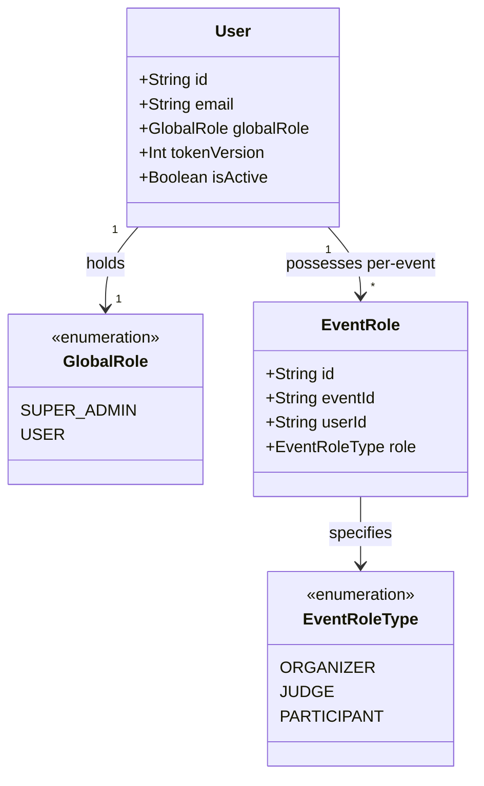
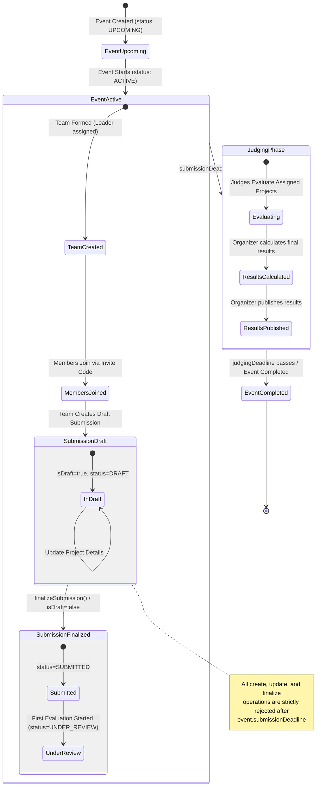
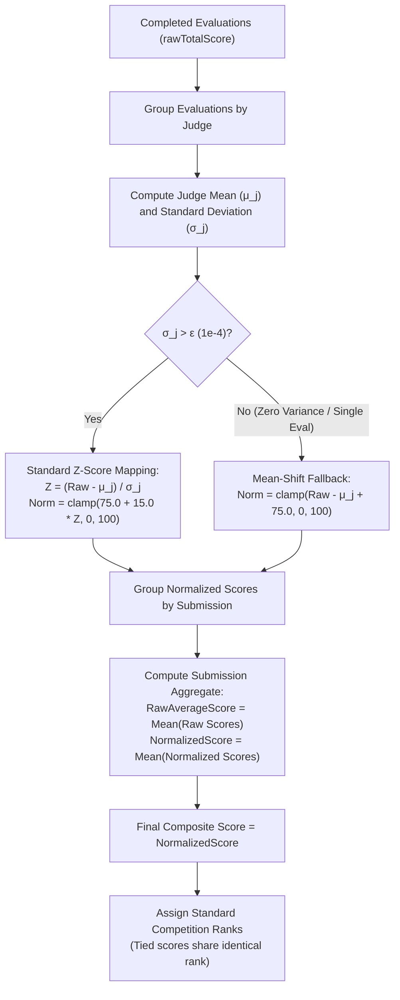
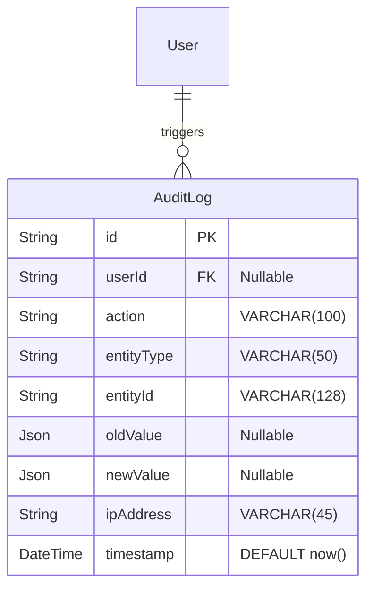
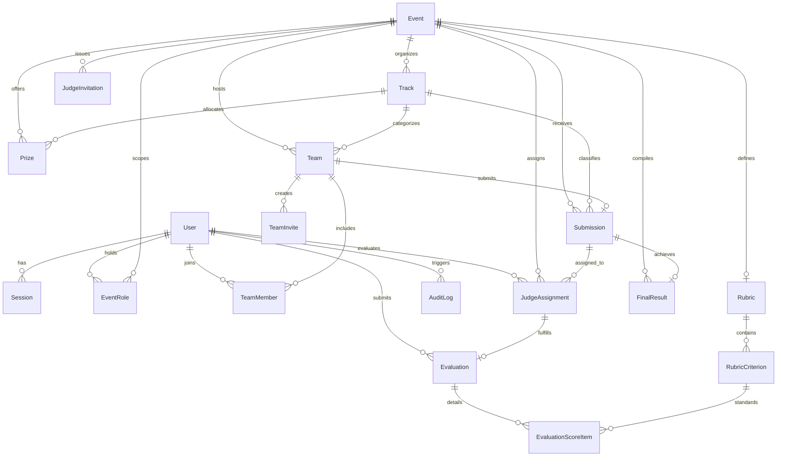
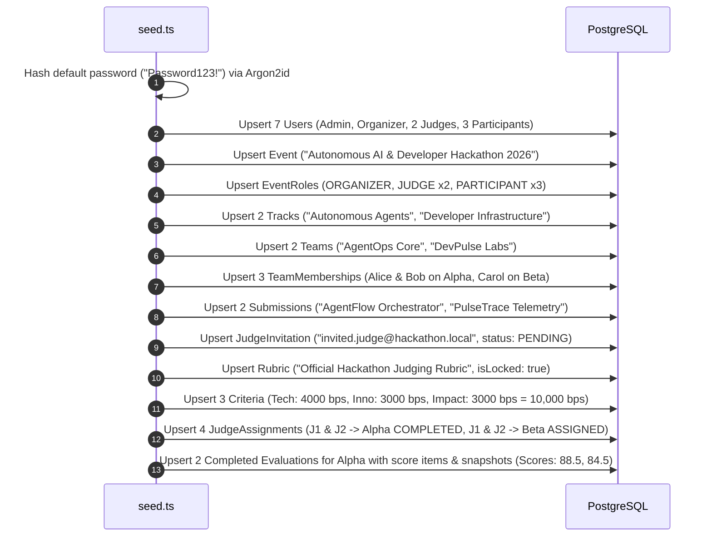

# Backend Architecture & System Design Documentation

This document describes the implemented backend architecture of the Hackathon Evaluation & Judging Platform. It covers the active modules, authentication and session lifecycle, role-based access control (RBAC), multi-tenant event scoping, team and submission workflows, the Phase T2 judging engine, mathematical score normalization, audit logging, database models, Docker Compose orchestration, and idempotent database seeding.

---

## 1. System Overview & Technology Stack

The platform backend is designed as a **Layered Modular Monolith** built on Node.js, Express, TypeScript, and Prisma ORM with PostgreSQL. Each domain capability is organized into an isolated module containing dedicated routes, Zod validation schemas, and service classes encapsulating business logic and database transactions.

```mermaid
graph TD
    Client["Client / Frontend / API Consumer"] -->|HTTP / JSON / Cookies| ExpressApp["Express Application (app.ts)"]
    
    subgraph Routing & Middleware Layer
        ExpressApp --> CORS["CORS & Cookie Parser"]
        ExpressApp --> HealthRoutes["/health & /api/health"]
        ExpressApp --> AuthRouter["/api/auth (auth.routes.ts)"]
        ExpressApp --> UserRouter["/api/users (user.routes.ts)"]
        ExpressApp --> EventRouter["/api/events (event.routes.ts)"]
        ExpressApp --> ProjectsRouter["/api/projects & /api/submissions"]
        ExpressApp --> TeamsAliasRouter["/api/teams"]
        ExpressApp --> VotesRouter["/api/votes"]
        ExpressApp --> CommentsRouter["/api/comments"]
        ExpressApp --> AuditRouter["/api/audit (audit.routes.ts)"]
        
        AuthMiddleware["auth.middleware.ts<br/>(resolveSession / requireAuthenticatedUser / optionalAuthenticatedUser)"]
        RBACMiddleware["rbac.middleware.ts<br/>(requireGlobalAdmin / requireAdminOrOrganizer / requireEventRole)"]
    end
    
    subgraph Event Sub-Routers
        EventRouter --> TracksSubRouter["/:eventId/tracks"]
        EventRouter --> PrizesSubRouter["/:eventId/prizes"]
        EventRouter --> TeamsSubRouter["/:eventId/teams & team-invites"]
        EventRouter --> SubmissionsSubRouter["/:eventId/submissions"]
        EventRouter --> JudgesSubRouter["/:eventId/judges"]
        EventRouter --> RubricsSubRouter["/:eventId/rubrics"]
        EventRouter --> JudgingSubRouter["/:eventId/judging"]
        EventRouter --> CommunitySubRouter["/:eventId/community"]
        EventRouter --> AuditSubRouter["/:eventId/audit"]
    end
    
    subgraph Service Layer
        AuthRouter --> AuthService["AuthService"]
        UserRouter --> UserService["UserService"]
        EventRouter --> EventService["EventService"]
        TracksSubRouter --> TrackService["TrackService"]
        PrizesSubRouter --> PrizeService["PrizeService"]
        TeamsSubRouter --> TeamService["TeamService"]
        SubmissionsSubRouter --> SubmissionService["SubmissionService"]
        JudgesSubRouter --> JudgeInvitationService["JudgeInvitationService"]
        JudgesSubRouter --> JudgeAssignmentService["JudgeAssignmentService"]
        RubricsSubRouter --> RubricService["RubricService"]
        JudgingSubRouter --> EvaluationService["EvaluationService"]
        JudgingSubRouter --> FinalResultService["FinalResultService"]
        FinalResultService --> NormalizationService["NormalizationService"]
        VotesRouter --> CommunityService["CommunityService"]
        CommentsRouter --> CommunityService
        CommunitySubRouter --> CommunityService
        AuditRouter --> AuditService["AuditService"]
        
        EventService --> AuditService
        TeamService --> AuditService
        SubmissionService --> AuditService
        UserService --> AuditService
        JudgeInvitationService --> AuditService
        JudgeAssignmentService --> AuditService
        RubricService --> AuditService
        EvaluationService --> AuditService
        FinalResultService --> AuditService
        CommunityService --> AuditService
    end

    
    subgraph Data Access Layer
        ServiceLayer["All Services"] --> PrismaClient["Prisma Client ORM (database.ts)"]
        PrismaClient --> PostgresDB[("PostgreSQL 16 Alpine Database")]
    end
```



### Core Technologies

| Component | Technology | Version | Purpose |
| :--- | :--- | :--- | :--- |
| **Runtime** | [Node.js](https://nodejs.org/) | `20.x Alpine` | Production execution runtime |
| **Language** | [TypeScript](https://www.typescriptlang.org/) | `^5.7.3` | Static typing and compiler checks |
| **Web Framework** | [Express](https://expressjs.com/) | `^4.21.2` | HTTP routing, middleware pipeline, and handlers |
| **Database ORM** | [Prisma](https://www.prisma.io/) | `^6.19.3` | Type-safe schema definition, client generation, and migrations |
| **Database Engine** | [PostgreSQL](https://www.postgresql.org/) | `16 Alpine` | Relational storage with relational integrity constraints |
| **Password Hashing** | [Argon2](https://github.com/ranisalt/node-argon2) | `^0.45.1` | Argon2id high-memory password hashing |
| **Validation** | [Zod](https://zod.dev/) | `^4.6.5` | Strict runtime input parsing and schema refinement |
| **Testing** | [Vitest](https://vitest.dev/) / [Supertest](https://github.com/ladjs/supertest) | `^5.0.2` / `^7.3.0` | Integration and unit test execution |

### Codebase Organization

```
backend/
├── Dockerfile                      # Multi-stage production container definition
├── package.json                    # Project dependencies, scripts, and seed config
├── tsconfig.json                   # TypeScript compiler options (target ES2022)
├── prisma/
│   ├── schema.prisma               # Prisma relational schema, enums, models, and indexes
│   ├── migrations/                 # Applied SQL migration history
│   └── seed.ts                     # Deterministic, idempotent fixture seed script
└── src/
    ├── app.ts                      # Express app setup, CORS, route mounting, error handling
    ├── index.ts                    # HTTP server entrypoint with graceful shutdown hooks
    ├── config/
    │   ├── database.ts             # Global PrismaClient singleton configuration
    │   └── env.ts                  # Environment variables loading and defaults
    ├── middleware/
    │   ├── auth.middleware.ts      # Database session resolution and requireAuthenticatedUser
    │   └── rbac.middleware.ts      # Event-scoped role enforcement (requireEventRole)
    ├── modules/
    │   ├── audit/                  # Audit logging service
    │   ├── auth/                   # Registration, login, logout, and session inspection
    │   ├── events/                 # Event creation, updates, and access checks
    │   ├── tracks/                 # Event track management
    │   ├── prizes/                 # Event prize categories and allocations
    │   ├── teams/                  # Teams, memberships, and team invitations
    │   ├── submissions/            # Project submissions, drafts, and finalization
    │   └── judging/                # Rubrics, judge invites, assignments, evaluations, normalization
    ├── types/
    │   └── express.d.ts            # Declaration merging attaching SafeUser & Session to Express.Request
    └── utils/
        └── crypto.ts               # Argon2id hashing, 256-bit token generation, SHA-256 token hashing
```

---

## 2. Authentication & Session Flow

The platform implements **stateful, database-backed sessions** stored in the [`Session`](file:///e:/dog_food_hackathon/backend/prisma/schema.prisma#L100) model rather than stateless JWTs. This architecture guarantees immediate revocation capability, prevents replay attacks after logout, and enables tracking of active user devices and security token invalidation.

```mermaid
sequenceDiagram
    autonumber
    actor Client as User / Browser
    participant API as Auth Controller (auth.routes.ts)
    participant Service as AuthService (auth.service.ts)
    participant Crypto as Crypto Utility (crypto.ts)
    participant DB as PostgreSQL (Session & User)

    Note over Client, DB: Registration Flow
    Client->>API: POST /api/auth/register { email, name, password }
    API->>Service: register(input)
    Service->>DB: Check User unique email
    Service->>Crypto: hashPassword(password) via Argon2id
    Service->>DB: INSERT INTO "User" (globalRole: USER, tokenVersion: 1)
    Service-->>API: SafeUser (passwordHash omitted)
    API-->>Client: 201 Created { user }

    Note over Client, DB: Login Flow
    Client->>API: POST /api/auth/login { email, password }
    API->>Service: login(input, metadata)
    Service->>DB: SELECT * FROM "User" WHERE email = ?
    Service->>Crypto: verifyPassword(input.password, user.passwordHash)
    Service->>Crypto: generateSessionToken() -> 32-byte hex rawToken
    Service->>Crypto: hashSessionToken(rawToken) -> SHA-256 sessionTokenHash
    Service->>DB: INSERT INTO "Session" (sessionTokenHash, userId, tokenVersion, expiresAt)
    Service-->>API: { rawToken, user, expiresAt }
    API-->>Client: Set-Cookie: session_token=<rawToken>; HttpOnly; SameSite=Lax
    API-->>Client: 200 OK { user }

    Note over Client, DB: Authenticated Request Flow
    Client->>API: GET /api/events/:eventId (Cookie: session_token=<rawToken>)
    API->>Crypto: hashSessionToken(rawToken)
    API->>DB: SELECT * FROM "Session" JOIN "User" WHERE sessionTokenHash = ?
    Note over API, DB: Validates: isValid == true, expiresAt > now, user.isActive, session.tokenVersion == user.tokenVersion
    API->>API: Attach req.user (SafeUser) & req.session
    API-->>Client: 200 OK Response

    Note over Client, DB: Logout Flow
    Client->>API: POST /api/auth/logout
    API->>Service: logout(rawToken)
    Service->>DB: UPDATE "Session" SET isValid = false WHERE sessionTokenHash = ?
    API-->>Client: Clear-Cookie: session_token; 200 OK
```

### Key Components

1. **Password Hashing ([crypto.ts](file:///e:/dog_food_hackathon/backend/src/utils/crypto.ts#L7))**:
   - Implemented using [`argon2.hash`](file:///e:/dog_food_hackathon/backend/src/utils/crypto.ts#L8) with `argon2id` variant.
   - Verified via [`argon2.verify`](file:///e:/dog_food_hackathon/backend/src/utils/crypto.ts#L19), suppressing internal errors and returning boolean status.

2. **Session Token Cryptography ([crypto.ts](file:///e:/dog_food_hackathon/backend/src/utils/crypto.ts#L28))**:
   - High-entropy tokens are generated using [`crypto.randomBytes(32).toString("hex")`](file:///e:/dog_food_hackathon/backend/src/utils/crypto.ts#L29) (256 bits of entropy).
   - Only the SHA-256 digest ([`hashSessionToken`](file:///e:/dog_food_hackathon/backend/src/utils/crypto.ts#L35)) is written to the database column `Session.sessionTokenHash`. If the database is read or leaked, raw session tokens cannot be derived.

3. **Session Resolution Pipeline ([auth.middleware.ts](file:///e:/dog_food_hackathon/backend/src/middleware/auth.middleware.ts#L10))**:
   - Evaluates incoming requests through the [`resolveSession`](file:///e:/dog_food_hackathon/backend/src/middleware/auth.middleware.ts#L10) helper.
   - Extracts the token from either:
     - HTTP-only cookie matching `config.sessionCookieName` (`session_token`).
     - `Authorization: Bearer <rawToken>` header.
   - Validates four strict safety invariants:
     1. Session record exists in database.
     2. `session.isValid === true` and `session.expiresAt > new Date()`.
     3. `session.user.isActive === true`.
     4. `session.tokenVersion === session.user.tokenVersion` (enabling global revocation across all active sessions by incrementing the user's `tokenVersion`).
   - Strips `passwordHash` to construct [`SafeUser`](file:///e:/dog_food_hackathon/backend/src/types/express.d.ts#L3) before assigning to `req.user`.

4. **Middleware Handlers ([auth.middleware.ts](file:///e:/dog_food_hackathon/backend/src/middleware/auth.middleware.ts#L61))**:
   - [`requireAuthenticatedUser`](file:///e:/dog_food_hackathon/backend/src/middleware/auth.middleware.ts#L61): Rejects unauthenticated requests with `401 UNAUTHORIZED`.
   - [`optionalAuthenticatedUser`](file:///e:/dog_food_hackathon/backend/src/middleware/auth.middleware.ts#L88): Populates `req.user` if a valid session is present without rejecting unauthenticated guests.

---

## 3. Global and Event-Scoped RBAC

The platform separates platform-level permissions from per-event participation roles.

### Role Separation



1. **Global Roles ([schema.prisma](file:///e:/dog_food_hackathon/backend/prisma/schema.prisma#L10))**:
   - `SUPER_ADMIN`: System-level administrator.
   - `USER`: Default user status for all standard registrants.
2. **Event-Scoped Roles ([schema.prisma](file:///e:/dog_food_hackathon/backend/prisma/schema.prisma#L15))**:
   - Defined in the [`EventRole`](file:///e:/dog_food_hackathon/backend/prisma/schema.prisma#L119) join table with a compound unique constraint: `@@unique([eventId, userId, role])`.
   - `ORGANIZER`: Event creator or designated event administrator. Full control over tracks, prizes, rubrics, judge assignments, and final results calculation/publishing.
   - `JUDGE`: Evaluator for an event. Can only evaluate submissions assigned to them; cannot modify event settings or view unassigned submissions.
   - `PARTICIPANT`: Team leader or team member registered in the event.

### RBAC Enforcement Architecture

Event authorization is enforced by the [`requireEventRole`](file:///e:/dog_food_hackathon/backend/src/middleware/rbac.middleware.ts#L9) factory:
1. Extracts `eventId` from route params (`req.params.eventId`), body (`req.body.eventId`), or query (`req.query.eventId`).
2. Rejects with `400 BAD_REQUEST` if `eventId` cannot be identified.
3. Queries `prisma.eventRole.findFirst({ where: { eventId, userId: req.user.id } })`.
4. Rejects with `403 FORBIDDEN` if the user has no role in the targeted event.
5. Verifies if the user's role is included in the `allowedRoles` list.
6. Attaches the validated role object to `req.eventRole`.

Specialized middleware exports ([rbac.middleware.ts](file:///e:/dog_food_hackathon/backend/src/middleware/rbac.middleware.ts#L67)):
- [`requireEventOrganizer`](file:///e:/dog_food_hackathon/backend/src/middleware/rbac.middleware.ts#L67) = `requireEventRole([EventRoleType.ORGANIZER])`
- [`requireEventJudge`](file:///e:/dog_food_hackathon/backend/src/middleware/rbac.middleware.ts#L68) = `requireEventRole([EventRoleType.JUDGE])`
- [`requireEventParticipant`](file:///e:/dog_food_hackathon/backend/src/middleware/rbac.middleware.ts#L69) = `requireEventRole([EventRoleType.PARTICIPANT])`
- [`requireAnyEventRole`](file:///e:/dog_food_hackathon/backend/src/middleware/rbac.middleware.ts#L70) = `requireEventRole([])` (requires any valid event role)

### Dual-Layer Authorization Pattern

The backend combines middleware-level role gates with service-level domain checks:

| Domain Action | Middleware Enforcement | Service-Level Domain Rule |
| :--- | :--- | :--- |
| **Create Event** | `requireAuthenticatedUser` | Creator is automatically assigned `ORGANIZER` in transaction ([event.service.ts](file:///e:/dog_food_hackathon/backend/src/modules/events/event.service.ts#L25)). |
| **Update Event** | `requireEventOrganizer` | Validates date chronology constraints ([event.service.ts](file:///e:/dog_food_hackathon/backend/src/modules/events/event.service.ts#L83)). |
| **Manage Tracks & Prizes** | `requireEventOrganizer` | Validates cross-event track scoping; prevents deleting tracks in use by submissions ([track.service.ts](file:///e:/dog_food_hackathon/backend/src/modules/tracks/track.service.ts#L105)). |
| **Create Team** | `requireAuthenticatedUser` | Enforces 1-team-per-event-per-user; creator assigned `LEADER` + `PARTICIPANT` ([team.service.ts](file:///e:/dog_food_hackathon/backend/src/modules/teams/team.service.ts#L21)). |
| **Update Team** | `requireAuthenticatedUser` | Caller must be the team's `LEADER` or the event's `ORGANIZER` ([team.service.ts](file:///e:/dog_food_hackathon/backend/src/modules/teams/team.service.ts#L172)). |
| **Create Submission** | `requireAuthenticatedUser` | User must be on the specified team; checks deadline; ensures 1 submission per team ([submission.service.ts](file:///e:/dog_food_hackathon/backend/src/modules/submissions/submission.service.ts#L51)). |
| **Submit Evaluation** | `requireEventJudge` | Evaluator must match `judgeId` in `JudgeAssignment`; checks rubric completeness ([evaluation.service.ts](file:///e:/dog_food_hackathon/backend/src/modules/judging/evaluation.service.ts#L118)). |
| **Update Evaluation** | `requireEventJudge` | Must be evaluator's own evaluation; blocked if results already published ([evaluation.service.ts](file:///e:/dog_food_hackathon/backend/src/modules/judging/evaluation.service.ts#L299)). |
| **Calculate & Publish** | `requireEventOrganizer` | Requires $\ge 1$ completed evaluation; recalculates normalization deterministically ([final-result.service.ts](file:///e:/dog_food_hackathon/backend/src/modules/judging/final-result.service.ts#L43)). |

---

## 4. Implemented Backend Modules

The backend contains 8 functional modules located under [`src/modules`](file:///e:/dog_food_hackathon/backend/src/modules):

```
backend/src/modules/
├── auth/          # Authentication & Session Module
├── events/        # Event Lifecycle Module
├── tracks/        # Tracks Sub-Module
├── prizes/        # Prizes Sub-Module
├── teams/         # Teams & Invites Module
├── submissions/   # Submissions Module
├── judging/       # Rubrics, Assignments, Evaluations, Normalization, & Final Results Module
└── audit/         # Audit Logging Module
```

### Module Descriptions & Endpoints

#### 1. Authentication Module ([auth](file:///e:/dog_food_hackathon/backend/src/modules/auth))
- **Routes**: [`auth.routes.ts`](file:///e:/dog_food_hackathon/backend/src/modules/auth/auth.routes.ts) mounted at `/api/auth`
- **Service**: [`AuthService`](file:///e:/dog_food_hackathon/backend/src/modules/auth/auth.service.ts#L13)
- **Endpoints**:
  - `POST /api/auth/register`: Creates new user account.
  - `POST /api/auth/login`: Authenticates with email and password, creates DB session, returns HTTP-only cookie.
  - `POST /api/auth/logout`: Invalidates active session in DB, clears cookie.
  - `GET /api/auth/me`: Returns currently authenticated user details.

#### 2. Events Module ([events](file:///e:/dog_food_hackathon/backend/src/modules/events))
- **Routes**: [`event.routes.ts`](file:///e:/dog_food_hackathon/backend/src/modules/events/event.routes.ts) mounted at `/api/events`
- **Service**: [`EventService`](file:///e:/dog_food_hackathon/backend/src/modules/events/event.service.ts#L5)
- **Validation**: [`createEventSchema`](file:///e:/dog_food_hackathon/backend/src/modules/events/event.schema.ts#L4), [`updateEventSchema`](file:///e:/dog_food_hackathon/backend/src/modules/events/event.schema.ts#L39)
- **Endpoints**:
  - `POST /api/events`: Creates event and establishes creator as `ORGANIZER` in an atomic transaction.
  - `GET /api/events/:eventId`: Fetches event details including tracks, prizes, and submission/team counts.
  - `PATCH /api/events/:eventId`: Updates event details (Organizer only).
  - `GET /api/events/:eventId/access`: Verifies current user's role assignment in the event.

#### 3. Tracks Sub-Module ([tracks](file:///e:/dog_food_hackathon/backend/src/modules/tracks))
- **Routes**: [`track.routes.ts`](file:///e:/dog_food_hackathon/backend/src/modules/tracks/track.routes.ts) mounted at `/api/events/:eventId/tracks`
- **Service**: [`TrackService`](file:///e:/dog_food_hackathon/backend/src/modules/tracks/track.service.ts#L4)
- **Endpoints**:
  - `POST /`: Creates a track (Organizer only).
  - `GET /`: Lists all tracks for the event.
  - `PATCH /:trackId`: Updates track details (Organizer only).
  - `DELETE /:trackId`: Deletes track (Organizer only). Blocked with `409 TRACK_IN_USE` if any submissions reference the track.

#### 4. Prizes Sub-Module ([prizes](file:///e:/dog_food_hackathon/backend/src/modules/prizes))
- **Routes**: [`prize.routes.ts`](file:///e:/dog_food_hackathon/backend/src/modules/prizes/prize.routes.ts) mounted at `/api/events/:eventId/prizes`
- **Service**: [`PrizeService`](file:///e:/dog_food_hackathon/backend/src/modules/prizes/prize.service.ts#L4)
- **Endpoints**:
  - `POST /`: Creates an event prize with optional track assignment (Organizer only). Validates cross-event track scoping.
  - `GET /`: Lists all prizes for the event.
  - `PATCH /:prizeId`: Updates prize details (Organizer only).
  - `DELETE /:prizeId`: Deletes prize (Organizer only).

#### 5. Teams & Invites Module ([teams](file:///e:/dog_food_hackathon/backend/src/modules/teams))
- **Routes**: [`team.routes.ts`](file:///e:/dog_food_hackathon/backend/src/modules/teams/team.routes.ts) mounted at `/api/events/:eventId/teams` and `/api/events/:eventId/team-invites`
- **Service**: [`TeamService`](file:///e:/dog_food_hackathon/backend/src/modules/teams/team.service.ts#L6)
- **Endpoints**:
  - `POST /`: Creates a new team in the event. Creator becomes `LEADER` and receives `PARTICIPANT` role.
  - `GET /:teamId`: Retrieves team members, track, and submission.
  - `PATCH /:teamId`: Updates team name or track (Team Leader or Organizer only).
  - `POST /:teamId/invites`: Generates an invite code and token (Team Member only; validates team capacity).
  - `POST /api/events/:eventId/team-invites/:inviteCode/accept`: Accepts team invite (Validates status, expiry, max uses, target email, capacity, and ensures user is not already on a team).

#### 6. Submissions Module ([submissions](file:///e:/dog_food_hackathon/backend/src/modules/submissions))
- **Routes**: [`submission.routes.ts`](file:///e:/dog_food_hackathon/backend/src/modules/submissions/submission.routes.ts) mounted at `/api/events/:eventId/submissions`
- **Service**: [`SubmissionService`](file:///e:/dog_food_hackathon/backend/src/modules/submissions/submission.service.ts#L5)
- **Endpoints**:
  - `POST /`: Creates a submission in draft or submitted status. Checks submission deadline, team membership, track scope, and ensures 1 submission per team.
  - `GET /:submissionId`: Retrieves submission details with team members and track.
  - `PATCH /:submissionId`: Updates project details (Team members only; rejected if submission deadline has passed).
  - `POST /:submissionId/finalize`: Finalizes draft to `SUBMITTED` status (Team members only; rejected if submission deadline has passed).

#### 7. Judging Module ([judging](file:///e:/dog_food_hackathon/backend/src/modules/judging))
- **Routes**: [`judging.routes.ts`](file:///e:/dog_food_hackathon/backend/src/modules/judging/judging.routes.ts) mounting three sub-routers:
  - `judgeRouter` mounted at `/api/events/:eventId/judges`
  - `rubricRouter` mounted at `/api/events/:eventId/rubrics`
  - `judgingRouter` mounted at `/api/events/:eventId/judging`
- **Services**:
  - [`JudgeInvitationService`](file:///e:/dog_food_hackathon/backend/src/modules/judging/judge-invitation.service.ts#L7): Invitations, cryptographic tokens, status transitions.
  - [`JudgeAssignmentService`](file:///e:/dog_food_hackathon/backend/src/modules/judging/judge-assignment.service.ts#L7): Single and batch round-robin assignments.
  - [`RubricService`](file:///e:/dog_food_hackathon/backend/src/modules/judging/rubric.service.ts#L10): Rubric configuration, criteria weight validation, immutability locking.
  - [`EvaluationService`](file:///e:/dog_food_hackathon/backend/src/modules/judging/evaluation.service.ts#L6): Evaluation submission, range checking, weighted score snapshots, judge/organizer progress.
  - [`NormalizationService`](file:///e:/dog_food_hackathon/backend/src/modules/judging/normalization.service.ts#L60): Cross-judge Z-score calculation and mean-shift fallback.
  - [`FinalResultService`](file:///e:/dog_food_hackathon/backend/src/modules/judging/final-result.service.ts#L7): Result aggregation, tie detection, publishing, CSV export.

#### 8. Audit Logging Module ([audit](file:///e:/dog_food_hackathon/backend/src/modules/audit))
- **Service**: [`AuditService`](file:///e:/dog_food_hackathon/backend/src/modules/audit/audit.service.ts#L13)
- Writes auditable events to the [`AuditLog`](file:///e:/dog_food_hackathon/backend/prisma/schema.prisma#L453) table.

---

## 5. Event, Team, and Submission Lifecycle

The system enforces strict multi-tenant isolation, deadline validation, and domain constraints across events, teams, and submissions:



### Constraints & Invariants

1. **Chronological Deadlines ([event.schema.ts](file:///e:/dog_food_hackathon/backend/src/modules/events/event.schema.ts#L19))**:
   - `startDate < endDate`
   - `startDate <= submissionDeadline <= endDate`
   - `submissionDeadline <= judgingDeadline`
2. **Team Constraints ([team.service.ts](file:///e:/dog_food_hackathon/backend/src/modules/teams/team.service.ts#L20))**:
   - Exactly **1 team per participant per event** (enforced by `TeamMember` compound unique index `@@unique([userId, eventId])`).
   - Team names must be unique within an event (`@@unique([eventId, name])`).
   - Team capacity is capped at `event.maxTeamSize` (default: 4).
3. **Submission Constraints ([submission.service.ts](file:///e:/dog_food_hackathon/backend/src/modules/submissions/submission.service.ts#L83))**:
   - Exactly **1 submission per team** (enforced by `Submission` compound unique index `@@unique([teamId, eventId])`).
   - Only registered members of the team can create, update, or finalize submissions.
   - All mutations and finalizations are rejected with `422 SUBMISSION_DEADLINE_EXPIRED` once `new Date() > event.submissionDeadline`.

---

## 6. Judging Engine (Phase T2) Architecture

The Phase T2 judging engine manages the complete evaluation workflow from judge invitations to score aggregation and publication.

```mermaid
graph TD
    subgraph 1. Preparation
        Organizer["Organizer"] -->|POST /invitations| SendInvite["Send Judge Invitation<br/>(32-byte hex token)"]
        JudgeUser["Invited User"] -->|POST /invitations/:id/accept| AcceptInvite["Accept Invitation<br/>(Assigns EventRole: JUDGE)"]
        Organizer -->|POST /rubrics & /criteria| ConfigRubric["Configure Rubric<br/>(Sum to exactly 10,000 bps)"]
        Organizer -->|PATCH /rubrics/:id (isLocked=true)| LockRubric["Lock Rubric<br/>(Becomes immutable)"]
    end

    subgraph 2. Assignment
        Organizer -->|POST /assignments or /assignments/batch| AssignSubmissions["Assign Submissions to Judges<br/>- Checks JUDGE role<br/>- Checks submission is SUBMITTED<br/>- Conflict of Interest check<br/>- Round-robin batch distribution"]
    end

    subgraph 3. Evaluation
        Judge["Assigned Judge"] -->|GET /judging/assignments| ViewAssigned["View Assigned Projects Only<br/>(Strict Access Isolation)"]
        Judge -->|POST /judging/assignments/:id/evaluation| SubmitEval["Submit Evaluation<br/>- Evaluates all criteria<br/>- Range checks [0, maxPoints]<br/>- Weighted raw score calculation<br/>- Saves historical snapshots"]
    end

    subgraph 4. Normalization & Results
        Organizer -->|POST /judging/final-results/calculate| CalcResults["Calculate Final Results<br/>- Cross-judge Z-Score normalization<br/>- Mean-shift zero-variance fallback<br/>- Fair tie preservation<br/>- Track rankings"]
        Organizer -->|POST /judging/final-results/publish| PublishResults["Publish Final Results<br/>(Unlocks participant access)"]
        Organizer -->|GET /judging/results.csv| ExportCSV["Export RFC-4180 CSV<br/>(Sanitized deterministic export)"]
    end
```

### 1. Judge Invitations ([judge-invitation.service.ts](file:///e:/dog_food_hackathon/backend/src/modules/judging/judge-invitation.service.ts#L7))
- Created by organizers for specific emails with a default expiration of 168 hours (7 days).
- Token is a 32-byte cryptographic hex string ([`crypto.randomBytes(32).toString("hex")`](file:///e:/dog_food_hackathon/backend/src/modules/judging/judge-invitation.service.ts#L69)).
- Acceptance validates:
  - Caller's email must match the invitation's target email.
  - Invitation is not expired, revoked, or already accepted.
- Upon acceptance, the user is atomically granted the `JUDGE` role in the event via `tx.eventRole.upsert`.

### 2. Rubric Configuration & Locking ([rubric.service.ts](file:///e:/dog_food_hackathon/backend/src/modules/judging/rubric.service.ts#L10))
- An event has at most one Rubric (`eventId @unique`).
- Weights are configured using **basis points** ($1 \text{ bp} = 0.01\%$, $10{,}000 \text{ bps} = 100.00\%$) to eliminate floating-point rounding errors during configuration.
- **Locking Invariant**: A rubric cannot be locked unless its criteria weights sum to **exactly 10,000 basis points** ([rubric.service.ts](file:///e:/dog_food_hackathon/backend/src/modules/judging/rubric.service.ts#L136)).
- **Immutability Guarantee**: Once `isLocked === true`, adding, modifying, or deleting criteria is rejected with `400 RUBRIC_LOCKED`.

### 3. Judge Assignments ([judge-assignment.service.ts](file:///e:/dog_food_hackathon/backend/src/modules/judging/judge-assignment.service.ts#L7))
- Enforces four strict safety checks:
  1. Selected user must have the `JUDGE` role in this specific event.
  2. Submission must belong to this event and must **not** be in `DRAFT` status (`SUBMISSION_IS_DRAFT`).
  3. **Conflict of Interest Protection**: A judge cannot evaluate a submission created by their own team (`CONFLICT_OF_INTEREST`).
  4. Duplicate assignments between the same judge and submission are prevented (`DUPLICATE_ASSIGNMENT`).
- **Deterministic Batch Assignment ([judge-assignment.service.ts](file:///e:/dog_food_hackathon/backend/src/modules/judging/judge-assignment.service.ts#L145))**:
  - Distributes submissions to judges in a balanced round-robin manner.
  - Submissions and judges are sorted deterministically by ID.
  - Uses formula `(sIdx * judgesPerSubmission + offset) % judges.length` while skipping conflicts and existing assignments.
  - Groups assignments under a traceable `batchId`.

### 4. Evaluation Submission & Historical Snapshots ([evaluation.service.ts](file:///e:/dog_food_hackathon/backend/src/modules/judging/evaluation.service.ts#L99))
- **Access Isolation**: Judges can only retrieve assignments explicitly assigned to their `userId` ([evaluation.service.ts](file:///e:/dog_food_hackathon/backend/src/modules/judging/evaluation.service.ts#L74)).
- All criteria in the active rubric must be scored (`INCOMPLETE_EVALUATION`).
- Scores must fall within $[0, \text{maxPoints}]$ for each criterion.
- **Raw Weighted Score Calculation**:
  $$\text{RawTotal} = \sum_{c} \left( \frac{\text{score}_c}{\text{maxPoints}_c} \times \frac{\text{weightBasisPoints}_c}{10000} \times 100 \right)$$
- **Historical Snapshots**:
  Each [`EvaluationScoreItem`](file:///e:/dog_food_hackathon/backend/prisma/schema.prisma#L381) stores immutable copies of:
  - `criterionNameSnapshot`
  - `weightSnapshot`
  - `maxPointsSnapshot`
  This preserves historical scoring validity even if rubric definitions change later.
- **State Transition**:
  - Setting `isDraft: false` transitions the assignment to `COMPLETED` and marks the submission as `UNDER_REVIEW`.
  - Once final results are published by the organizer, existing evaluations are permanently locked against modifications (`RESULTS_ALREADY_PUBLISHED`).

---

## 7. Score Normalization & Tie-Breaking

To adjust for variations in judge scoring leniency and strictness, the backend includes a deterministic normalization engine.

### Mathematical Specification



1. **Judge Statistics**:
   For each judge $j$ who evaluated submissions $S_j$:
   $$\mu_j = \frac{1}{|S_j|} \sum_{s \in S_j} R_{j,s}$$
   $$\sigma_j = \sqrt{ \frac{1}{|S_j|} \sum_{s \in S_j} (R_{j,s} - \mu_j)^2 }$$
   where $R_{j,s}$ is the raw total score assigned by judge $j$ to submission $s$.

2. **Target Distribution**:
   - $\text{Target Mean } (T_\mu) = 75.0$
   - $\text{Target Standard Deviation } (T_\sigma) = 15.0$
   - Epsilon threshold $\epsilon = 10^{-4}$

3. **Standard Normalization ($\sigma_j > \epsilon$)**:
   $$Z_{j,s} = \frac{R_{j,s} - \mu_j}{\sigma_j}$$
   $$\text{Normalized}_{j,s} = \text{clamp}(T_\mu + T_\sigma \cdot Z_{j,s}, 0, 100)$$

4. **Zero-Variance / Single-Evaluation Fallback ($\sigma_j \le \epsilon$)**:
   When a judge evaluates only one project or gives identical scores to all assigned projects, division by zero is avoided using a mean-shift fallback:
   $$\text{Normalized}_{j,s} = \text{clamp}(R_{j,s} - \mu_j + T_\mu, 0, 100)$$

5. **Submission Aggregation**:
   For submission $s$ evaluated by completed evaluations $E_s$:
   $$\text{NormalizedScore}(s) = \frac{1}{|E_s|} \sum_{e \in E_s} \text{Normalized}_{j,s}$$
   $$\text{RawAverageScore}(s) = \frac{1}{|E_s|} \sum_{e \in E_s} R_{j,s}$$

### Tie-Breaking and Rank Determination Rules

1. **Fair Ranks for Tied Scores**:
   If Submission A and Submission B both have a composite score of $85.0000$, both receive the **same rank** (e.g., both receive Rank 1).
2. **Explicit Tie Documentation**:
   When ties occur, the `tieBreakerReason` field is populated with:
   `"Tied at composite score <score> (unresolved tie; no official tie-breaker specified)"`
   When scores are distinct, `tieBreakerReason` is `null`.
3. **Deterministic Row Output**:
   To guarantee stable database queries and reproducible CSV exports, rows are ordered deterministically by:
   - Primary: `finalCompositeScore DESC`
   - Secondary: `submissionId ASC` (row ordering only; **does not affect rank**)
4. **Track Ranking**:
   Submissions within a track are ranked following the same tie-preserving rule (`trackRank`).

### Results Publishing and CSV Export

- `POST /api/events/:eventId/judging/final-results/publish`:
  Atomically marks results as published in `FinalResult` and updates `Event.resultsPublished = true`.
- `GET /api/events/:eventId/judging/final-results`:
  Organizers can view results anytime; participants and public can only access results after publication.
- `GET /api/events/:eventId/judging/results.csv`:
  Organizer-only RFC-4180 compliant CSV export with escaped fields and headers:
  `Rank`, `Track Rank`, `Project Name`, `Team Name`, `Track`, `Raw Average Score`, `Normalized Score`, `Final Composite Score`, `Completed Evaluations Count`, `Tie Breaker Reason`.

---

## 8. Audit Logging Subsystem

The platform provides a centralized, append-only audit trail in the [`AuditLog`](file:///e:/dog_food_hackathon/backend/prisma/schema.prisma#L453) table, managed by [`AuditService`](file:///e:/dog_food_hackathon/backend/src/modules/audit/audit.service.ts#L13).

### Audit Schema Definition



### Audited Actions

| Action Code | Entity Type | Trigger Context |
| :--- | :--- | :--- |
| `JUDGE_INVITATION_CREATED` | `JudgeInvitation` | Organizer issues an invitation to a judge. |
| `JUDGE_INVITATION_ACCEPTED` | `JudgeInvitation` | Judge accepts invitation and receives `JUDGE` role. |
| `JUDGE_INVITATION_REVOKED` | `JudgeInvitation` | Organizer revokes an active invitation. |
| `RUBRIC_CREATED` | `Rubric` | Organizer creates event rubric. |
| `RUBRIC_UPDATED` | `Rubric` | Organizer renames or locks the rubric. |
| `RUBRIC_CRITERION_ADDED` | `RubricCriterion` | Organizer adds a criterion. |
| `RUBRIC_CRITERION_UPDATED` | `RubricCriterion` | Organizer adjusts criterion weight or max points. |
| `JUDGE_ASSIGNMENT_CREATED` | `JudgeAssignment` | Organizer assigns a judge to a submission. |
| `JUDGE_ASSIGNMENTS_BATCH_CREATED` | `JudgeAssignmentBatch` | Organizer executes batch round-robin assignment. |
| `EVALUATION_SUBMITTED` | `Evaluation` | Judge submits an evaluation. |
| `EVALUATION_UPDATED` | `Evaluation` | Judge updates an evaluation prior to result publication. |
| `FINAL_RESULTS_CALCULATED` | `FinalResult` | Organizer triggers normalization and ranking calculation. |
| `FINAL_RESULTS_PUBLISHED` | `Event` | Organizer publishes final results. |

---

## 9. Database & Prisma Architecture

The database is defined in [`backend/prisma/schema.prisma`](file:///e:/dog_food_hackathon/backend/prisma/schema.prisma) using PostgreSQL 16.



### Implemented Model Matrix

| Model | Table Name | Purpose | Critical Indexes & Uniqueness |
| :--- | :--- | :--- | :--- |
| [`User`](file:///e:/dog_food_hackathon/backend/prisma/schema.prisma#L77) | `User` | Platform user accounts | `email @unique` |
| [`Session`](file:///e:/dog_food_hackathon/backend/prisma/schema.prisma#L100) | `Session` | Database-backed login sessions | `sessionTokenHash @unique`, `[userId, isValid]` |
| [`EventRole`](file:///e:/dog_food_hackathon/backend/prisma/schema.prisma#L119) | `EventRole` | Event-scoped RBAC assignments | `@@unique([eventId, userId, role])` |
| [`Event`](file:///e:/dog_food_hackathon/backend/prisma/schema.prisma#L133) | `Event` | Hackathon instances | `id @id` |
| [`Track`](file:///e:/dog_food_hackathon/backend/prisma/schema.prisma#L164) | `Track` | Competition categories | `@@unique([eventId, name])`, `@@unique([id, eventId])` |
| [`Prize`](file:///e:/dog_food_hackathon/backend/prisma/schema.prisma#L180) | `Prize` | Award categories and cash values | `@@index([eventId])` |
| [`PrizeAward`](file:///e:/dog_food_hackathon/backend/prisma/schema.prisma#L196) | `PrizeAward` | Assigned prize winners | `@@unique([prizeId, submissionId])` |
| [`Team`](file:///e:/dog_food_hackathon/backend/prisma/schema.prisma#L213) | `Team` | Participant teams | `@@unique([eventId, name])`, `@@unique([id, eventId])` |
| [`TeamMember`](file:///e:/dog_food_hackathon/backend/prisma/schema.prisma#L231) | `TeamMember` | Team memberships | `@@unique([teamId, userId])`, `@@unique([userId, eventId])` |
| [`TeamInvite`](file:///e:/dog_food_hackathon/backend/prisma/schema.prisma#L248) | `TeamInvite` | Team join invitations | `inviteCode @unique`, `inviteToken @unique` |
| [`Submission`](file:///e:/dog_food_hackathon/backend/prisma/schema.prisma#L266) | `Submission` | Hackathon project submissions | `teamId @unique`, `@@unique([id, eventId])`, `@@unique([teamId, eventId])` |
| [`JudgeInvitation`](file:///e:/dog_food_hackathon/backend/prisma/schema.prisma#L298) | `JudgeInvitation` | Organizer-issued judge invites | `@@unique([eventId, email])`, `invitationToken @unique` |
| [`Rubric`](file:///e:/dog_food_hackathon/backend/prisma/schema.prisma#L315) | `Rubric` | Event scoring rubrics | `eventId @unique` |
| [`RubricCriterion`](file:///e:/dog_food_hackathon/backend/prisma/schema.prisma#L327) | `RubricCriterion` | Weighted scoring criteria | `@@index([rubricId, orderIndex])` |
| [`JudgeAssignment`](file:///e:/dog_food_hackathon/backend/prisma/schema.prisma#L342) | `JudgeAssignment` | Judge-to-submission allocations | `@@unique([judgeId, submissionId])`, `@@index([eventId, judgeId])` |
| [`Evaluation`](file:///e:/dog_food_hackathon/backend/prisma/schema.prisma#L361) | `Evaluation` | Completed judge evaluations | `assignmentId @unique`, `@@unique([submissionId, judgeId])` |
| [`EvaluationScoreItem`](file:///e:/dog_food_hackathon/backend/prisma/schema.prisma#L381) | `EvaluationScoreItem` | Criterion scores & historical snapshots | `@@unique([evaluationId, criterionId])` |
| [`FinalResult`](file:///e:/dog_food_hackathon/backend/prisma/schema.prisma#L397) | `FinalResult` | Aggregated, normalized scores & ranks | `submissionId @unique`, `@@index([eventId, rank])` |
| [`AuditLog`](file:///e:/dog_food_hackathon/backend/prisma/schema.prisma#L453) | `AuditLog` | Append-only security audit trail | `@@index([entityType, entityId])`, `@@index([timestamp])` |

> [!NOTE]
> **Schema-Defined vs. Active Modules**:
> The Prisma schema includes several models defined for future phases: [`CommunityVote`](file:///e:/dog_food_hackathon/backend/prisma/schema.prisma#L417), [`CommunityComment`](file:///e:/dog_food_hackathon/backend/prisma/schema.prisma#L435), [`WebhookSubscription`](file:///e:/dog_food_hackathon/backend/prisma/schema.prisma#L471), [`WebhookDelivery`](file:///e:/dog_food_hackathon/backend/prisma/schema.prisma#L482), [`Certificate`](file:///e:/dog_food_hackathon/backend/prisma/schema.prisma#L498), and [`SignedJudgeRecord`](file:///e:/dog_food_hackathon/backend/prisma/schema.prisma#L515). These models exist in the database schema to ensure relational forward-compatibility, but do not have active API routes mounted in `app.ts`.

---

## 10. Docker Compose & Deployment Architecture

The platform provides a production container environment managed via [`docker-compose.yml`](file:///e:/dog_food_hackathon/docker-compose.yml).

```mermaid
graph LR
    subgraph Host System
        Compose["docker compose up"]
    end

    subgraph Docker Network: default
        PostgresContainer["postgres service<br/>(hackathon_postgres:5432)<br/>image: postgres:16-alpine"]
        BackendContainer["backend service<br/>(hackathon_backend:5000)<br/>node:20-alpine runner"]
        Volume[("Named Volume<br/>postgres_data")]
    end

    Compose --> PostgresContainer
    Compose --> BackendContainer
    PostgresContainer --> Volume
    BackendContainer -.->|depends_on: service_healthy| PostgresContainer
    BackendContainer -->|DATABASE_URL: postgres:5432| PostgresContainer
```

### Multi-Stage Dockerfile ([backend/Dockerfile](file:///e:/dog_food_hackathon/backend/Dockerfile))

1. **Stage 1: Builder (`node:20-alpine AS builder`)**:
   - Installs system build dependencies (`openssl libc6-compat python3 make g++`) required for native compilation of [`argon2`](file:///e:/dog_food_hackathon/backend/package.json#L21) and Prisma engines.
   - Copies `package.json` and `package-lock.json` and runs `npm ci`.
   - Generates Prisma client via `npx prisma generate`.
   - Compiles TypeScript via `npm run build` (`tsc`).
   - Prunes development dependencies via `npm prune --omit=dev`.
   - Regenerates a clean Prisma client for the pruned production modules.

2. **Stage 2: Production Runner (`node:20-alpine AS runner`)**:
   - Installs runtime dynamic libraries (`openssl libc6-compat libstdc++`).
   - Sets `NODE_ENV=production` and `PORT=5000`.
   - Copies pruned production `node_modules`, compiled `dist`, and `prisma` definitions from the builder stage.
   - **Container Startup Command**:
     ```sh
     npx prisma migrate deploy && npx prisma db seed && exec node dist/index.js
     ```
     This ensures schema migrations are deployed and idempotent demo fixtures are populated before the HTTP server starts listening.

### Compose Service Definitions

- **`postgres` service**:
  - Image: `postgres:16-alpine`
  - Healthcheck test: `pg_isready -U postgres -d dogfood_hackathon` (interval 5s, timeout 5s, retries 5).
  - Storage: Named volume `postgres_data` mapped to `/var/lib/postgresql/data`.
- **`backend` service**:
  - Built from `./backend/Dockerfile`.
  - Condition: `depends_on: { postgres: { condition: service_healthy } }`.
  - Maps port `5000:5000`.

---

## 11. Seed Flow & Demo Dataset

The database fixture population is driven by [`backend/prisma/seed.ts`](file:///e:/dog_food_hackathon/backend/prisma/seed.ts), which runs deterministically using fixed UUIDs ([`SEED_CONSTANTS`](file:///e:/dog_food_hackathon/backend/prisma/seed.ts#L16)). It is completely **idempotent**, using `upsert` operations throughout so it can be re-run safely without creating duplicate records.

### Seed Execution Flow



### Seeded Demo Accounts

> [!CAUTION]
> All demo accounts use the development password: `Password123!`. These credentials are strictly intended for local demonstration and automated testing.

| Email | Name | Global Role | Event Role | Context / Role in Event |
| :--- | :--- | :--- | :--- | :--- |
| `admin@hackathon.local` | System Administrator | `SUPER_ADMIN` | — | Platform administrator |
| `organizer@hackathon.local` | Elena Vance | `USER` | `ORGANIZER` | Hackathon organizer managing rubrics and assignments |
| `judge1@hackathon.local` | Dr. Marcus Brody | `USER` | `JUDGE` | Evaluator (completed eval for Team Alpha, assigned to Team Beta) |
| `judge2@hackathon.local` | Dr. Sarah Chen | `USER` | `JUDGE` | Evaluator (completed eval for Team Alpha, assigned to Team Beta) |
| `alice@hackathon.local` | Alice Johnson | `USER` | `PARTICIPANT` | Leader of **AgentOps Core** (`Autonomous Agents` track) |
| `bob@hackathon.local` | Bob Smith | `USER` | `PARTICIPANT` | Member of **AgentOps Core** |
| `carol@hackathon.local` | Carol Williams | `USER` | `PARTICIPANT` | Leader of **DevPulse Labs** (`Developer Infrastructure` track) |

### Seeded Fixtures

1. **Event**:
   - ID: `00000000-0000-4000-8000-000000000001`
   - Name: `Autonomous AI & Developer Hackathon 2026`
   - Status: `ACTIVE`, `maxTeamSize: 4`, `resultsPublished: false`
2. **Tracks**:
   - `Autonomous Agents` (ID: `...0011`)
   - `Developer Infrastructure` (ID: `...0012`)
3. **Teams & Submissions**:
   - `AgentOps Core`: Project *"AgentFlow Orchestrator"* (Status: `SUBMITTED`, Track: Autonomous Agents).
   - `DevPulse Labs`: Project *"PulseTrace Telemetry"* (Status: `SUBMITTED`, Track: Developer Infrastructure).
4. **Rubric & Weighted Criteria**:
   - `Technical Execution & Architecture`: 4,000 basis points (40.00%, max 10.0 points)
   - `Innovation & Originality`: 3,000 basis points (30.00%, max 10.0 points)
   - `Impact & Practical Utility`: 3,000 basis points (30.00%, max 10.0 points)
   - **Total**: Exactly 10,000 basis points (100.00%) with `isLocked: true`.
5. **Assignments & Evaluations**:
   - Submission 1 (*AgentFlow Orchestrator*): Evaluated by Judge 1 (raw score: 88.50) and Judge 2 (raw score: 84.50).
   - Submission 2 (*PulseTrace Telemetry*): Assigned to Judge 1 and Judge 2 with status `ASSIGNED` (ready for evaluation).
6. **Judge Invitation**:
   - Pending invitation for `invited.judge@hackathon.local` with token `seed_judge_invite_token_0000000000000000000000000000000000000001`.
