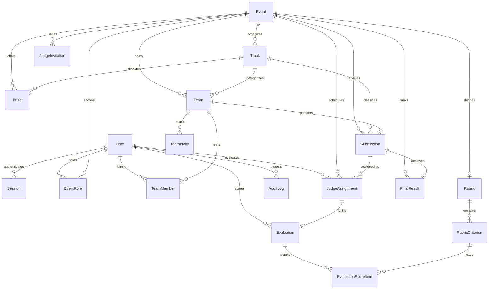
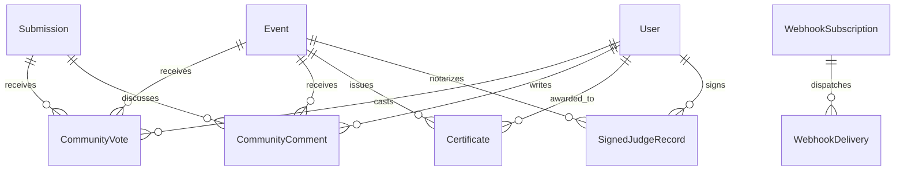

# Database Data Model & Schema Specification

This document provides the definitive data model specification for the Hackathon Evaluation & Judging Platform, based strictly on [`backend/prisma/schema.prisma`](file:///e:/dog_food_hackathon/backend/prisma/schema.prisma). It details all database entities, enumerations, relational mappings, compound foreign keys, uniqueness constraints, performance indexes, and referential integrity guarantees.

---

## 1. Overview & Implementation Status

The schema is implemented in PostgreSQL 16 using Prisma ORM. The relational model is partitioned into:
1. **Active Core Entities**: Directly managed and mutated by the implemented backend controllers, services, and middleware (Authentication, Events, Tracks, Prizes, Teams, Submissions, Judging Phase T2, Normalization, and Audit Logging).
2. **Schema-Defined Future / Stretch Entities**: Fully defined in the Prisma schema to guarantee relational forward-compatibility, but not exposed in active Express router controllers (Community Voting, Community Comments, Webhooks, Certificates, and Signed Judge Records).

### Entity Classification Matrix

| Entity Model | Classification | Description / Functional Domain |
| :--- | :--- | :--- |
| [`User`](file:///e:/dog_food_hackathon/backend/prisma/schema.prisma#L77) | **Active** | System accounts, global administration, and credential hashes |
| [`Session`](file:///e:/dog_food_hackathon/backend/prisma/schema.prisma#L100) | **Active** | Stateful server-side session tokens with SHA-256 digests |
| [`EventRole`](file:///e:/dog_food_hackathon/backend/prisma/schema.prisma#L119) | **Active** | Event-scoped role-based access control assignments |
| [`Event`](file:///e:/dog_food_hackathon/backend/prisma/schema.prisma#L133) | **Active** | Hackathon instances, status, and chronological deadlines |
| [`Track`](file:///e:/dog_food_hackathon/backend/prisma/schema.prisma#L164) | **Active** | Competition categories within an event |
| [`Prize`](file:///e:/dog_food_hackathon/backend/prisma/schema.prisma#L180) | **Active** | Track and event-level cash and honorary awards |
| [`PrizeAward`](file:///e:/dog_food_hackathon/backend/prisma/schema.prisma#L196) | **Active** | Winning submission assignments for prizes |
| [`Team`](file:///e:/dog_food_hackathon/backend/prisma/schema.prisma#L213) | **Active** | Participant teams competing within an event |
| [`TeamMember`](file:///e:/dog_food_hackathon/backend/prisma/schema.prisma#L231) | **Active** | Team roster memberships and team-level roles |
| [`TeamInvite`](file:///e:/dog_food_hackathon/backend/prisma/schema.prisma#L248) | **Active** | Cryptographic join tokens and invite codes for teams |
| [`Submission`](file:///e:/dog_food_hackathon/backend/prisma/schema.prisma#L266) | **Active** | Project entries submitted by teams |
| [`JudgeInvitation`](file:///e:/dog_food_hackathon/backend/prisma/schema.prisma#L298) | **Active** | Organizer-issued judge onboarding tokens |
| [`Rubric`](file:///e:/dog_food_hackathon/backend/prisma/schema.prisma#L315) | **Active** | 1:1 event evaluation configuration and immutability lock |
| [`RubricCriterion`](file:///e:/dog_food_hackathon/backend/prisma/schema.prisma#L327) | **Active** | Basis-point weighted scoring criteria |
| [`JudgeAssignment`](file:///e:/dog_food_hackathon/backend/prisma/schema.prisma#L342) | **Active** | Judge-to-submission allocations and batch IDs |
| [`Evaluation`](file:///e:/dog_food_hackathon/backend/prisma/schema.prisma#L361) | **Active** | Completed/draft evaluation records with raw score totals |
| [`EvaluationScoreItem`](file:///e:/dog_food_hackathon/backend/prisma/schema.prisma#L381) | **Active** | Per-criterion scores and historical snapshot preserves |
| [`FinalResult`](file:///e:/dog_food_hackathon/backend/prisma/schema.prisma#L397) | **Active** | Aggregated, normalized scores, overall/track ranks, and ties |
| [`AuditLog`](file:///e:/dog_food_hackathon/backend/prisma/schema.prisma#L453) | **Active** | Append-only security audit trail |
| [`CommunityVote`](file:///e:/dog_food_hackathon/backend/prisma/schema.prisma#L417) | *Future / Stretch* | Public/participant upvoting and anti-fraud fingerprinting |
| [`CommunityComment`](file:///e:/dog_food_hackathon/backend/prisma/schema.prisma#L435) | *Future / Stretch* | Moderated public discussion comments on submissions |
| [`WebhookSubscription`](file:///e:/dog_food_hackathon/backend/prisma/schema.prisma#L471) | *Future / Stretch* | Outbound webhook endpoint subscriptions and HMAC secrets |
| [`WebhookDelivery`](file:///e:/dog_food_hackathon/backend/prisma/schema.prisma#L482) | *Future / Stretch* | Outbound event delivery attempts, payloads, and HTTP status |
| [`Certificate`](file:///e:/dog_food_hackathon/backend/prisma/schema.prisma#L498) | *Future / Stretch* | Participation and winner credentials with unique verification codes |
| [`SignedJudgeRecord`](file:///e:/dog_food_hackathon/backend/prisma/schema.prisma#L515) | *Future / Stretch* | Cryptographically signed judge score attestations and hashes |

---

## 2. Enumerations (Data Dictionaries)

All enumerations are defined at the database level using PostgreSQL native enum types.

### [`GlobalRole`](file:///e:/dog_food_hackathon/backend/prisma/schema.prisma#L10)
Defines system-wide platform privileges:
- `SUPER_ADMIN`: Full administrative control across the platform.
- `USER`: Default role for all standard registrants.

### [`EventRoleType`](file:///e:/dog_food_hackathon/backend/prisma/schema.prisma#L15)
Defines permissions scoped strictly to a specific [`Event`](file:///e:/dog_food_hackathon/backend/prisma/schema.prisma#L133):
- `ORGANIZER`: Event creator or administrator. Manages tracks, prizes, rubrics, judge assignments, and publishes final results.
- `JUDGE`: Evaluator for assigned submissions in the event.
- `PARTICIPANT`: Team member or team leader competing in the event.

### [`EventStatus`](file:///e:/dog_food_hackathon/backend/prisma/schema.prisma#L21)
Defines the lifecycle state of a hackathon:
- `UPCOMING`: Event registered, configuration and registrations in progress.
- `ACTIVE`: Hacking and submission phase open.
- `COMPLETED`: Judging concluded and event finalized.

### [`TeamRole`](file:///e:/dog_food_hackathon/backend/prisma/schema.prisma#L27)
Defines membership permissions within a [`Team`](file:///e:/dog_food_hackathon/backend/prisma/schema.prisma#L213):
- `LEADER`: Team creator or captain. Authorized to update team metadata.
- `MEMBER`: Standard team member. Can invite others and edit submissions.

### [`InviteStatus`](file:///e:/dog_food_hackathon/backend/prisma/schema.prisma#L32)
Defines the validity of a [`TeamInvite`](file:///e:/dog_food_hackathon/backend/prisma/schema.prisma#L248):
- `ACTIVE`: Available for acceptance.
- `REVOKED`: Manually invalidated by team management.
- `EXPIRED`: Inactive due to exceeding the expiration timestamp.

### [`SubmissionStatus`](file:///e:/dog_food_hackathon/backend/prisma/schema.prisma#L38)
Defines the review lifecycle of a [`Submission`](file:///e:/dog_food_hackathon/backend/prisma/schema.prisma#L266):
- `DRAFT`: In-progress draft; ineligible for judge assignments.
- `SUBMITTED`: Finalized by team; eligible for judge assignments.
- `UNDER_REVIEW`: At least one judge evaluation is in progress or completed.
- `EVALUATED`: All assigned judge evaluations are complete.

### [`JudgeInviteStatus`](file:///e:/dog_food_hackathon/backend/prisma/schema.prisma#L45)
Defines the state of a [`JudgeInvitation`](file:///e:/dog_food_hackathon/backend/prisma/schema.prisma#L298):
- `PENDING`: Issued by organizer; awaiting acceptance.
- `ACCEPTED`: Accepted by invited user; user converted to `JUDGE` role.
- `EXPIRED`: Time-to-live exceeded.
- `REVOKED`: Cancelled by organizer prior to acceptance.

### [`AssignmentStatus`](file:///e:/dog_food_hackathon/backend/prisma/schema.prisma#L52)
Defines the evaluation progress of a [`JudgeAssignment`](file:///e:/dog_food_hackathon/backend/prisma/schema.prisma#L342):
- `ASSIGNED`: Allocated to judge; evaluation not yet started.
- `IN_PROGRESS`: Evaluation draft created and saved by judge.
- `COMPLETED`: Evaluation completed and submitted by judge.

### [`CommentStatus`](file:///e:/dog_food_hackathon/backend/prisma/schema.prisma#L58) *(Future / Stretch)*
Moderation state for [`CommunityComment`](file:///e:/dog_food_hackathon/backend/prisma/schema.prisma#L435):
- `APPROVED`: Publicly visible.
- `PENDING`: Queued for moderation.
- `FLAGGED`: Reported by community.
- `REMOVED`: Hidden by administrator.

### [`DeliveryStatus`](file:///e:/dog_food_hackathon/backend/prisma/schema.prisma#L65) *(Future / Stretch)*
HTTP delivery state for [`WebhookDelivery`](file:///e:/dog_food_hackathon/backend/prisma/schema.prisma#L482):
- `PENDING`: Queued for dispatch.
- `SUCCESS`: 2xx response received from target endpoint.
- `FAILED`: Exhausted delivery retry budget.

### [`CertificateType`](file:///e:/dog_food_hackathon/backend/prisma/schema.prisma#L71) *(Future / Stretch)*
Classification for issued [`Certificate`](file:///e:/dog_food_hackathon/backend/prisma/schema.prisma#L498) records:
- `PARTICIPATION`: General participation certificate.
- `WINNER`: Overall hackathon winner.
- `TRACK_WINNER`: Track-specific award winner.

---

## 3. Active / Implemented Core Entities



---

### 3.1 Identity & Session Models

#### [`User`](file:///e:/dog_food_hackathon/backend/prisma/schema.prisma#L77)
Represents platform user accounts.
- **Fields**:
  - `id`: `String` (UUID, Primary Key, `@default(uuid())`)
  - `email`: `String` (Unique, indexable email address)
  - `name`: `String` (`VARCHAR(120)`)
  - `passwordHash`: `String` (`VARCHAR(255)`, Argon2id hashed password)
  - `globalRole`: `GlobalRole` (`@default(USER)`)
  - `tokenVersion`: `Int` (`@default(1)`, incremented to globally invalidate all active user sessions)
  - `isActive`: `Boolean` (`@default(true)`, deactivated users are immediately blocked by auth middleware)
  - `createdAt`: `DateTime` (`@default(now())`)
  - `updatedAt`: `DateTime` (`@updatedAt`)
- **Constraints & Indexes**:
  - `@id` on `id`
  - `@unique` on `email`

#### [`Session`](file:///e:/dog_food_hackathon/backend/prisma/schema.prisma#L100)
Represents active, database-backed user login sessions.
- **Fields**:
  - `id`: `String` (UUID, Primary Key, `@default(uuid())`)
  - `sessionTokenHash`: `String` (`VARCHAR(64)`, Unique SHA-256 hash of the 32-byte hex raw session token)
  - `userId`: `String` (Foreign Key -> `User.id`)
  - `tokenVersion`: `Int` (`@default(1)`, must match `User.tokenVersion` to be valid)
  - `ipAddress`: `String?` (`VARCHAR(45)`, IPv4 or IPv6 address)
  - `userAgent`: `String?` (`VARCHAR(500)`)
  - `isValid`: `Boolean` (`@default(true)`, toggled to `false` on logout)
  - `expiresAt`: `DateTime` (Expiration timestamp)
  - `createdAt`: `DateTime` (`@default(now())`)
  - `updatedAt`: `DateTime` (`@updatedAt`)
- **Foreign Keys & Integrity**:
  - `userId` -> `User.id` with `onDelete: Cascade`
- **Constraints & Indexes**:
  - `@id` on `id`
  - `@unique` on `sessionTokenHash`
  - `@@index([sessionTokenHash])`
  - `@@index([expiresAt])`
  - `@@index([userId, isValid])`

---

### 3.2 Event Scoping & RBAC Models

#### [`EventRole`](file:///e:/dog_food_hackathon/backend/prisma/schema.prisma#L119)
Implements event-scoped RBAC, decoupling permissions from global user state.
- **Fields**:
  - `id`: `String` (UUID, Primary Key, `@default(uuid())`)
  - `eventId`: `String` (Foreign Key -> `Event.id`)
  - `userId`: `String` (Foreign Key -> `User.id`)
  - `role`: `EventRoleType` (`ORGANIZER`, `JUDGE`, or `PARTICIPANT`)
  - `createdAt`: `DateTime` (`@default(now())`)
- **Foreign Keys & Integrity**:
  - `eventId` -> `Event.id` with `onDelete: Cascade`
  - `userId` -> `User.id` with `onDelete: Cascade`
- **Constraints & Indexes**:
  - `@@unique([eventId, userId, role])` (A user can hold at most one instance of each role per event)
  - `@@index([userId, eventId])`

#### [`Event`](file:///e:/dog_food_hackathon/backend/prisma/schema.prisma#L133)
Core event aggregate defining hackathon constraints, deadlines, and state.
- **Fields**:
  - `id`: `String` (UUID, Primary Key, `@default(uuid())`)
  - `name`: `String` (`VARCHAR(255)`)
  - `description`: `String?` (`TEXT`)
  - `status`: `EventStatus` (`@default(UPCOMING)`)
  - `startDate`: `DateTime`
  - `endDate`: `DateTime`
  - `submissionDeadline`: `DateTime`
  - `judgingDeadline`: `DateTime`
  - `resultsPublished`: `Boolean` (`@default(false)`, controls public visibility of scores and rankings)
  - `maxTeamSize`: `Int` (`@default(4)`, upper bound for team membership)
  - `createdAt`: `DateTime` (`@default(now())`)
  - `updatedAt`: `DateTime` (`@updatedAt`)
- **Integrity Rules (Application Enforced)**:
  - `startDate < endDate`
  - `startDate <= submissionDeadline <= endDate`
  - `submissionDeadline <= judgingDeadline`

---

### 3.3 Tracks & Prizes Models

#### [`Track`](file:///e:/dog_food_hackathon/backend/prisma/schema.prisma#L164)
Competition track categories within an event.
- **Fields**:
  - `id`: `String` (UUID, Primary Key, `@default(uuid())`)
  - `eventId`: `String` (Foreign Key -> `Event.id`)
  - `name`: `String` (`VARCHAR(100)`)
  - `description`: `String?` (`TEXT`)
  - `createdAt`: `DateTime` (`@default(now())`)
- **Foreign Keys & Integrity**:
  - `eventId` -> `Event.id` with `onDelete: Cascade`
- **Constraints & Indexes**:
  - `@@unique([eventId, name])` (Track names must be unique within an event)
  - `@@unique([id, eventId])` (Compound key used by dependent models to enforce event scoping)

#### [`Prize`](file:///e:/dog_food_hackathon/backend/prisma/schema.prisma#L180)
Prizes offered within an event, optionally associated with a specific track.
- **Fields**:
  - `id`: `String` (UUID, Primary Key, `@default(uuid())`)
  - `eventId`: `String` (Foreign Key -> `Event.id`)
  - `trackId`: `String?` (Foreign Key -> `Track.id`, nullable for overall event prizes)
  - `name`: `String` (`VARCHAR(150)`)
  - `description`: `String?` (`TEXT`)
  - `cashValue`: `Decimal` (`DECIMAL(10, 2)`, `@default(0)`)
  - `createdAt`: `DateTime` (`@default(now())`)
- **Foreign Keys & Integrity**:
  - `eventId` -> `Event.id` with `onDelete: Cascade`
  - `trackId` -> `Track.id` with `onDelete: SetNull`
- **Constraints & Indexes**:
  - `@@index([eventId])`

#### [`PrizeAward`](file:///e:/dog_food_hackathon/backend/prisma/schema.prisma#L196)
Join entity linking prizes to winning submissions.
- **Fields**:
  - `id`: `String` (UUID, Primary Key, `@default(uuid())`)
  - `prizeId`: `String` (Foreign Key -> `Prize.id`)
  - `submissionId`: `String` (Foreign Key -> `Submission.id`)
  - `eventId`: `String` (Foreign Key -> `Event.id`)
  - `rankPosition`: `Int` (`@default(1)`)
  - `notes`: `String?` (`VARCHAR(255)`)
  - `awardedAt`: `DateTime` (`@default(now())`)
- **Foreign Keys & Integrity**:
  - `prizeId` -> `Prize.id` with `onDelete: Cascade`
  - `submissionId` -> `Submission.id` with `onDelete: Cascade`
  - `eventId` -> `Event.id` with `onDelete: Cascade`
- **Constraints & Indexes**:
  - `@@unique([prizeId, submissionId])` (A submission cannot receive the same prize more than once)
  - `@@index([eventId, prizeId])`

---

### 3.4 Team & Membership Models

#### [`Team`](file:///e:/dog_food_hackathon/backend/prisma/schema.prisma#L213)
Represents a team of participants in an event.
- **Fields**:
  - `id`: `String` (UUID, Primary Key, `@default(uuid())`)
  - `eventId`: `String` (Foreign Key -> `Event.id`)
  - `trackId`: `String?` (Foreign Key -> `Track.id`)
  - `name`: `String` (`VARCHAR(150)`)
  - `createdAt`: `DateTime` (`@default(now())`)
  - `updatedAt`: `DateTime` (`@updatedAt`)
- **Foreign Keys & Integrity**:
  - `eventId` -> `Event.id` with `onDelete: Cascade`
  - `trackId` -> `Track.id` with `onDelete: SetNull`
- **Constraints & Indexes**:
  - `@@unique([eventId, name])` (Team names must be unique within an event)
  - `@@unique([id, eventId])` (Compound key for composite foreign key references)

#### [`TeamMember`](file:///e:/dog_food_hackathon/backend/prisma/schema.prisma#L231)
Join entity linking users to teams.
- **Fields**:
  - `id`: `String` (UUID, Primary Key, `@default(uuid())`)
  - `teamId`: `String`
  - `userId`: `String` (Foreign Key -> `User.id`)
  - `eventId`: `String` (Foreign Key -> `Event.id`)
  - `role`: `TeamRole` (`LEADER` or `MEMBER`, `@default(MEMBER)`)
  - `joinedAt`: `DateTime` (`@default(now())`)
- **Foreign Keys & Integrity**:
  - `[teamId, eventId]` -> `Team.[id, eventId]` with `onDelete: Cascade` (Enforces that team and membership belong to the exact same event)
  - `userId` -> `User.id` with `onDelete: Cascade`
  - `eventId` -> `Event.id` with `onDelete: Cascade`
- **Constraints & Indexes**:
  - `@@unique([teamId, userId])` (User cannot join the same team twice)
  - `@@unique([userId, eventId])` (**Strict Invariant: Exactly 1 team per user per event**)
  - `@@index([eventId, userId])`

#### [`TeamInvite`](file:///e:/dog_food_hackathon/backend/prisma/schema.prisma#L248)
Stores join codes and invitation tokens for recruiting team members.
- **Fields**:
  - `id`: `String` (UUID, Primary Key, `@default(uuid())`)
  - `teamId`: `String` (Foreign Key -> `Team.id`)
  - `inviteCode`: `String` (`VARCHAR(12)`, Unique 8-byte hex code for manual user entry)
  - `inviteToken`: `String` (`VARCHAR(64)`, Unique 32-byte hex token for link-based acceptance)
  - `targetEmail`: `String?` (`VARCHAR(255)`, Optional email restriction)
  - `maxUses`: `Int` (`@default(5)`)
  - `usedCount`: `Int` (`@default(0)`)
  - `status`: `InviteStatus` (`@default(ACTIVE)`)
  - `expiresAt`: `DateTime`
  - `createdAt`: `DateTime` (`@default(now())`)
- **Foreign Keys & Integrity**:
  - `teamId` -> `Team.id` with `onDelete: Cascade`
- **Constraints & Indexes**:
  - `@unique` on `inviteCode`
  - `@unique` on `inviteToken`
  - `@@index([inviteCode])`
  - `@@index([inviteToken])`

---

### 3.5 Submission Model

#### [`Submission`](file:///e:/dog_food_hackathon/backend/prisma/schema.prisma#L266)
Represents a project submitted by a team.
- **Fields**:
  - `id`: `String` (UUID, Primary Key, `@default(uuid())`)
  - `eventId`: `String` (Foreign Key -> `Event.id`)
  - `teamId`: `String` (Foreign Key -> `Team.id`, Unique)
  - `trackId`: `String` (Foreign Key -> `Track.id`)
  - `projectName`: `String` (`VARCHAR(255)`)
  - `tagline`: `String?` (`VARCHAR(300)`)
  - `description`: `String` (`TEXT`)
  - `repoUrl`: `String?` (`VARCHAR(500)`)
  - `demoUrl`: `String?` (`VARCHAR(500)`)
  - `videoUrl`: `String?` (`VARCHAR(500)`)
  - `isDraft`: `Boolean` (`@default(true)`)
  - `submittedAt`: `DateTime?`
  - `status`: `SubmissionStatus` (`@default(DRAFT)`)
  - `createdAt`: `DateTime` (`@default(now())`)
  - `updatedAt`: `DateTime` (`@updatedAt`)
- **Foreign Keys & Integrity**:
  - `[teamId, eventId]` -> `Team.[id, eventId]` with `onDelete: Restrict` (**Prevents accidental deletion of a team if a submission exists**)
  - `eventId` -> `Event.id` with `onDelete: Cascade`
  - `[trackId, eventId]` -> `Track.[id, eventId]` with `onDelete: Restrict` (**Prevents deletion of a track actively referenced by submissions**)
- **Constraints & Indexes**:
  - `@unique` on `teamId` (**Strict Invariant: Exactly 1 submission per team**)
  - `@@unique([id, eventId])` (Compound key used for scoped child relations)
  - `@@unique([teamId, eventId])`
  - `@@index([eventId, status])`
  - `@@index([trackId])`

---

### 3.6 Judging Engine (Phase T2) Models

#### [`JudgeInvitation`](file:///e:/dog_food_hackathon/backend/prisma/schema.prisma#L298)
Tracks judge invitations issued by event organizers.
- **Fields**:
  - `id`: `String` (UUID, Primary Key, `@default(uuid())`)
  - `eventId`: `String` (Foreign Key -> `Event.id`)
  - `email`: `String` (`VARCHAR(255)`)
  - `invitationToken`: `String` (`VARCHAR(64)`, Unique 32-byte cryptographic hex token)
  - `invitedByUserId`: `String` (Organizer user ID)
  - `status`: `JudgeInviteStatus` (`@default(PENDING)`)
  - `expiresAt`: `DateTime` (Default TTL: 168 hours / 7 days)
  - `acceptedAt`: `DateTime?`
  - `createdAt`: `DateTime` (`@default(now())`)
- **Foreign Keys & Integrity**:
  - `eventId` -> `Event.id` with `onDelete: Cascade`
- **Constraints & Indexes**:
  - `@@unique([eventId, email])` (Prevents duplicate invitations to the same email within an event)
  - `@unique` on `invitationToken`
  - `@@index([invitationToken])`

#### [`Rubric`](file:///e:/dog_food_hackathon/backend/prisma/schema.prisma#L315)
Defines the scoring schema for an event.
- **Fields**:
  - `id`: `String` (UUID, Primary Key, `@default(uuid())`)
  - `eventId`: `String` (Foreign Key -> `Event.id`, Unique)
  - `name`: `String` (`VARCHAR(120)`)
  - `isLocked`: `Boolean` (`@default(false)`, when `true`, criteria become immutable)
  - `createdAt`: `DateTime` (`@default(now())`)
  - `updatedAt`: `DateTime` (`@updatedAt`)
- **Foreign Keys & Integrity**:
  - `eventId` -> `Event.id` with `onDelete: Cascade`
- **Constraints & Indexes**:
  - `@unique` on `eventId` (**Strict Invariant: Exactly 1 rubric per event**)

#### [`RubricCriterion`](file:///e:/dog_food_hackathon/backend/prisma/schema.prisma#L327)
Individual weighted scoring criteria belonging to a rubric.
- **Fields**:
  - `id`: `String` (UUID, Primary Key, `@default(uuid())`)
  - `rubricId`: `String` (Foreign Key -> `Rubric.id`)
  - `name`: `String` (`VARCHAR(100)`)
  - `description`: `String?` (`TEXT`)
  - `weightBasisPoints`: `Int` (Integer basis points: 100 bps = 1.00%, 10,000 bps = 100.00%)
  - `maxPoints`: `Decimal` (`DECIMAL(5, 2)`, maximum raw score, typically 10.00)
  - `orderIndex`: `Int` (Display sorting index)
- **Foreign Keys & Integrity**:
  - `rubricId` -> `Rubric.id` with `onDelete: Cascade`
- **Constraints & Indexes**:
  - `@@index([rubricId, orderIndex])`
- **Validation Rules**:
  - All criteria in a rubric must sum to exactly **10,000 basis points** before the rubric can be locked.

#### [`JudgeAssignment`](file:///e:/dog_food_hackathon/backend/prisma/schema.prisma#L342)
Allocates a submission to a judge for evaluation.
- **Fields**:
  - `id`: `String` (UUID, Primary Key, `@default(uuid())`)
  - `eventId`: `String` (Foreign Key -> `Event.id`)
  - `judgeId`: `String` (Foreign Key -> `User.id`)
  - `submissionId`: `String`
  - `batchId`: `String?` (`VARCHAR(64)`, Traceable identifier for batch round-robin assignments)
  - `status`: `AssignmentStatus` (`@default(ASSIGNED)`)
  - `assignedAt`: `DateTime` (`@default(now())`)
- **Foreign Keys & Integrity**:
  - `eventId` -> `Event.id` with `onDelete: Cascade`
  - `judgeId` -> `User.id` with `onDelete: Cascade`
  - `[submissionId, eventId]` -> `Submission.[id, eventId]` with `onDelete: Cascade` (Enforces cross-event isolation)
- **Constraints & Indexes**:
  - `@@unique([judgeId, submissionId])` (**Prevents duplicate assignments of the same submission to a judge**)
  - `@@index([eventId, judgeId])`
  - `@@index([batchId])`

#### [`Evaluation`](file:///e:/dog_food_hackathon/backend/prisma/schema.prisma#L361)
Evaluation record submitted by an assigned judge.
- **Fields**:
  - `id`: `String` (UUID, Primary Key, `@default(uuid())`)
  - `assignmentId`: `String` (Foreign Key -> `JudgeAssignment.id`, Unique)
  - `submissionId`: `String` (Foreign Key -> `Submission.id`)
  - `judgeId`: `String` (Foreign Key -> `User.id`)
  - `rawTotalScore`: `Decimal` (`DECIMAL(7, 4)`, Deterministic weighted score scaled to 0–100)
  - `feedback`: `String?` (`TEXT`)
  - `isDraft`: `Boolean` (`@default(false)`)
  - `submittedAt`: `DateTime` (`@default(now())`)
  - `updatedAt`: `DateTime` (`@updatedAt`)
- **Foreign Keys & Integrity**:
  - `assignmentId` -> `JudgeAssignment.id` with `onDelete: Cascade`
  - `judgeId` -> `User.id` with `onDelete: Restrict`
- **Constraints & Indexes**:
  - `@unique` on `assignmentId` (**Strict 1:1 relation with JudgeAssignment**)
  - `@@unique([submissionId, judgeId])`
  - `@@index([judgeId])`
  - `@@index([submissionId])`

#### [`EvaluationScoreItem`](file:///e:/dog_food_hackathon/backend/prisma/schema.prisma#L381)
Criterion breakdown of an evaluation with historical snapshots.
- **Fields**:
  - `id`: `String` (UUID, Primary Key, `@default(uuid())`)
  - `evaluationId`: `String` (Foreign Key -> `Evaluation.id`)
  - `criterionId`: `String` (Foreign Key -> `RubricCriterion.id`)
  - `score`: `Decimal` (`DECIMAL(5, 2)`, Raw score awarded in $[0, \text{maxPointsSnapshot}]$)
  - `comment`: `String?` (`VARCHAR(500)`)
  - `criterionNameSnapshot`: `String` (`VARCHAR(100)`, Historical snapshot of criterion name)
  - `weightSnapshot`: `Int` (Historical snapshot of basis points weight)
  - `maxPointsSnapshot`: `Decimal` (`DECIMAL(5, 2)`, Historical snapshot of max points)
- **Foreign Keys & Integrity**:
  - `evaluationId` -> `Evaluation.id` with `onDelete: Cascade`
  - `criterionId` -> `RubricCriterion.id` with `onDelete: Restrict`
- **Constraints & Indexes**:
  - `@@unique([evaluationId, criterionId])` (A criterion cannot be scored more than once per evaluation)

#### [`FinalResult`](file:///e:/dog_food_hackathon/backend/prisma/schema.prisma#L397)
Aggregated, normalized scores and competition ranks for a submission.
- **Fields**:
  - `id`: `String` (UUID, Primary Key, `@default(uuid())`)
  - `eventId`: `String` (Foreign Key -> `Event.id`)
  - `submissionId`: `String` (Foreign Key -> `Submission.id`, Unique)
  - `rawAverageScore`: `Decimal` (`DECIMAL(7, 4)`, Mean of unnormalized raw total scores)
  - `normalizedScore`: `Decimal` (`DECIMAL(7, 4)`, Mean of Z-score normalized scores)
  - `communityVoteCount`: `Int` (`@default(0)`)
  - `finalCompositeScore`: `Decimal` (`DECIMAL(7, 4)`, Current composite ranking score)
  - `rank`: `Int` (Overall competition rank; tied scores share identical rank)
  - `trackRank`: `Int?` (Rank within track; tied scores share identical track rank)
  - `tieBreakerReason`: `String?` (`VARCHAR(255)`, Explicit documentation of tie status)
  - `isPublished`: `Boolean` (`@default(false)`)
  - `publishedAt`: `DateTime?`
- **Foreign Keys & Integrity**:
  - `eventId` -> `Event.id` with `onDelete: Cascade`
  - `submissionId` -> `Submission.id` with `onDelete: Cascade`
- **Constraints & Indexes**:
  - `@unique` on `submissionId` (**Strict 1:1 relation with Submission**)
  - `@@index([eventId, rank])`

---

### 3.7 Audit Subsystem Model

#### [`AuditLog`](file:///e:/dog_food_hackathon/backend/prisma/schema.prisma#L453)
Append-only log of critical operations across the platform.
- **Fields**:
  - `id`: `String` (UUID, Primary Key, `@default(uuid())`)
  - `userId`: `String?` (Foreign Key -> `User.id`, nullable for unauthenticated or system actions)
  - `action`: `String` (`VARCHAR(100)`, Action identifier, e.g., `EVALUATION_SUBMITTED`, `FINAL_RESULTS_PUBLISHED`)
  - `entityType`: `String` (`VARCHAR(50)`, e.g., `Evaluation`, `Rubric`, `JudgeAssignment`)
  - `entityId`: `String` (`VARCHAR(128)`, Target entity UUID)
  - `oldValue`: `Json?` (Pre-mutation state snapshot)
  - `newValue`: `Json?` (Post-mutation state snapshot)
  - `ipAddress`: `String?` (`VARCHAR(45)`, Caller IP)
  - `timestamp`: `DateTime` (`@default(now())`)
- **Foreign Keys & Integrity**:
  - `userId` -> `User.id` with `onDelete: SetNull` (Preserves audit history if user account is deleted)
- **Constraints & Indexes**:
  - `@@index([entityType, entityId])`
  - `@@index([timestamp])`
  - `@@index([userId])`

---

## 4. Schema-Defined Future / Stretch Entities

These models are defined in [`backend/prisma/schema.prisma`](file:///e:/dog_food_hackathon/backend/prisma/schema.prisma) to maintain schema forward-compatibility for upcoming phases. They are not exposed in active route controllers.



---

### 4.1 Community Engagement Models

#### [`CommunityVote`](file:///e:/dog_food_hackathon/backend/prisma/schema.prisma#L417)
Enables public/participant voting on submissions with fingerprint-based anti-fraud protection.
- **Fields**:
  - `id`: `String` (UUID, Primary Key, `@default(uuid())`)
  - `eventId`: `String` (Foreign Key -> `Event.id`)
  - `submissionId`: `String` (Foreign Key -> `Submission.id`)
  - `voterUserId`: `String?` (Foreign Key -> `User.id`, nullable for unauthenticated votes)
  - `voterFingerprint`: `String` (`VARCHAR(128)`, Client device/browser hash)
  - `ipAddress`: `String?` (`VARCHAR(45)`)
  - `createdAt`: `DateTime` (`@default(now())`)
- **Foreign Keys & Integrity**:
  - `eventId` -> `Event.id` with `onDelete: Cascade`
  - `submissionId` -> `Submission.id` with `onDelete: Cascade`
  - `voterUserId` -> `User.id` with `onDelete: SetNull`
- **Constraints & Indexes**:
  - `@@unique([eventId, voterFingerprint, submissionId])` (Prevents duplicate votes from the same device for a submission)
  - `@@index([submissionId])`
  - `@@index([voterUserId])`

#### [`CommunityComment`](file:///e:/dog_food_hackathon/backend/prisma/schema.prisma#L435)
Enables moderated community discussions on submissions.
- **Fields**:
  - `id`: `String` (UUID, Primary Key, `@default(uuid())`)
  - `eventId`: `String` (Foreign Key -> `Event.id`)
  - `submissionId`: `String` (Foreign Key -> `Submission.id`)
  - `authorUserId`: `String` (Foreign Key -> `User.id`)
  - `content`: `String` (`TEXT`)
  - `moderationStatus`: `CommentStatus` (`@default(APPROVED)`)
  - `createdAt`: `DateTime` (`@default(now())`)
  - `updatedAt`: `DateTime` (`@updatedAt`)
- **Foreign Keys & Integrity**:
  - `eventId` -> `Event.id` with `onDelete: Cascade`
  - `submissionId` -> `Submission.id` with `onDelete: Cascade`
  - `authorUserId` -> `User.id` with `onDelete: Cascade`
- **Constraints & Indexes**:
  - `@@index([submissionId, moderationStatus])`
  - `@@index([authorUserId])`

---

### 4.2 Webhook Infrastructure Models

#### [`WebhookSubscription`](file:///e:/dog_food_hackathon/backend/prisma/schema.prisma#L471)
Stores third-party webhook endpoints for automated platform event notifications.
- **Fields**:
  - `id`: `String` (UUID, Primary Key, `@default(uuid())`)
  - `name`: `String` (`VARCHAR(100)`)
  - `targetUrl`: `String` (`VARCHAR(500)`)
  - `secretToken`: `String` (`VARCHAR(64)`, Shared HMAC secret)
  - `subscribedEvents`: `String[]` (Array of event strings, e.g., `["submission.created", "results.published"]`)
  - `isActive`: `Boolean` (`@default(true)`)
  - `createdAt`: `DateTime` (`@default(now())`)

#### [`WebhookDelivery`](file:///e:/dog_food_hackathon/backend/prisma/schema.prisma#L482)
Tracks outbound webhook delivery attempts and payloads.
- **Fields**:
  - `id`: `String` (UUID, Primary Key, `@default(uuid())`)
  - `subscriptionId`: `String` (Foreign Key -> `WebhookSubscription.id`)
  - `event`: `String` (`VARCHAR(100)`)
  - `payload`: `Json` (Dispatched payload)
  - `httpStatus`: `Int?` (Response status code from target endpoint)
  - `attempts`: `Int` (`@default(0)`)
  - `status`: `DeliveryStatus` (`@default(PENDING)`)
  - `deliveredAt`: `DateTime?`
- **Foreign Keys & Integrity**:
  - `subscriptionId` -> `WebhookSubscription.id` with `onDelete: Cascade`
- **Constraints & Indexes**:
  - `@@index([subscriptionId, status])`

---

### 4.3 Verifiable Credentials & Attestations

#### [`Certificate`](file:///e:/dog_food_hackathon/backend/prisma/schema.prisma#L498)
Issues verifiable digital credentials for event participants and winners.
- **Fields**:
  - `id`: `String` (UUID, Primary Key, `@default(uuid())`)
  - `eventId`: `String` (Foreign Key -> `Event.id`)
  - `recipientUserId`: `String` (Foreign Key -> `User.id`)
  - `recipientName`: `String` (`VARCHAR(150)`)
  - `certificateType`: `CertificateType`
  - `certificateCode`: `String` (`VARCHAR(64)`, Unique verification code)
  - `metadataJson`: `Json?`
  - `issuedAt`: `DateTime` (`@default(now())`)
- **Foreign Keys & Integrity**:
  - `eventId` -> `Event.id` with `onDelete: Cascade`
  - `recipientUserId` -> `User.id` with `onDelete: Cascade`
- **Constraints & Indexes**:
  - `@unique` on `certificateCode`
  - `@@index([certificateCode])`
  - `@@index([recipientUserId, eventId])`

#### [`SignedJudgeRecord`](file:///e:/dog_food_hackathon/backend/prisma/schema.prisma#L515)
Stores non-repudiable cryptographic attestations of judge scoring.
- **Fields**:
  - `id`: `String` (UUID, Primary Key, `@default(uuid())`)
  - `eventId`: `String` (Foreign Key -> `Event.id`)
  - `judgeUserId`: `String` (Foreign Key -> `User.id`)
  - `evaluationsCount`: `Int`
  - `canonicalPayloadText`: `String` (`TEXT`, Canonical JSON representation of completed evaluations)
  - `digitalSignature`: `String` (`VARCHAR(512)`, Cryptographic digital signature)
  - `keyIdentifier`: `String` (`VARCHAR(64)`)
  - `verificationHash`: `String` (`VARCHAR(64)`, Unique verification hash)
  - `issuedAt`: `DateTime` (`@default(now())`)
- **Foreign Keys & Integrity**:
  - `eventId` -> `Event.id` with `onDelete: Cascade`
  - `judgeUserId` -> `User.id` with `onDelete: Cascade`
- **Constraints & Indexes**:
  - `@unique` on `verificationHash`
  - `@@index([verificationHash])`
  - `@@index([judgeUserId, eventId])`

---

## 5. Relational Integrity & Multi-Tenant Scoping Rules

To prevent data corruption and cross-event data leakage in multi-tenant environments, the schema combines compound unique constraints, compound foreign keys, and explicit deletion rules:

```mermaid
graph TD
    subgraph Multi-Tenant Scoping Guards
        Event["Event (id)"]
        Track["Track (id, eventId)"]
        Team["Team (id, eventId)"]
        Submission["Submission (id, eventId, teamId, trackId)"]
        Member["TeamMember (teamId, eventId, userId)"]
        Assignment["JudgeAssignment (judgeId, submissionId, eventId)"]
        
        Event -->|Cascade| Track
        Event -->|Cascade| Team
        
        Team -->|Compound FK: [teamId, eventId]| Member
        Team -.->|Restrict On Delete| Submission
        Track -.->|Restrict On Delete| Submission
        Submission -->|Compound FK: [submissionId, eventId]| Assignment
    end
```

### 1. Compound Foreign Key Isolation
- `TeamMember` references `Team` on `[teamId, eventId]`. A user cannot be added to a team under a mismatched `eventId`.
- `Submission` references `Team` on `[teamId, eventId]`. A submission cannot reference a team belonging to a different event.
- `Submission` references `Track` on `[trackId, eventId]`. A submission cannot be filed under a track belonging to another event.
- `JudgeAssignment` references `Submission` on `[submissionId, eventId]`. A judge cannot be assigned to evaluate a submission outside the targeted event.

### 2. Referential Deletion Policies (`onDelete`)
- **`Cascade`**: Child records are automatically cleaned up when parent containers are deleted:
  - `Session` cascades on `User` deletion.
  - `EventRole`, `Track`, `Prize`, `Team`, `Submission`, `JudgeInvitation`, `Rubric`, `JudgeAssignment`, and `FinalResult` cascade on `Event` deletion.
  - `EvaluationScoreItem` cascades on `Evaluation` deletion.
- **`Restrict`**: Deletion is blocked if child records exist, preventing accidental data loss:
  - `Team` cannot be deleted if a `Submission` exists (`onDelete: Restrict`).
  - `Track` cannot be deleted if referenced by any `Submission` (`onDelete: Restrict`).
  - `User` cannot be deleted if an `Evaluation` has been recorded under their ID (`onDelete: Restrict`).
  - `RubricCriterion` cannot be deleted if referenced by any `EvaluationScoreItem` (`onDelete: Restrict`).
- **`SetNull`**: Foreign key is cleared while preserving the referencing record:
  - `Prize.trackId` is set to `null` if the referenced `Track` is removed.
  - `Team.trackId` is set to `null` if the referenced `Track` is removed.
  - `AuditLog.userId` is set to `null` if the acting `User` is removed, preserving the security audit trail.

### 3. Historical Snapshot Preservation
When a judge evaluates a project, scoring parameters are snapshotted in [`EvaluationScoreItem`](file:///e:/dog_food_hackathon/backend/prisma/schema.prisma#L381):
- `criterionNameSnapshot`
- `weightSnapshot`
- `maxPointsSnapshot`

Even if an organizer later renames criteria, alters weights, or adjusts scales on the rubric, completed evaluations retain their original mathematical contributions and descriptions.

---

## 6. Constraints and Indexes Master Summary

| Model | Primary Key | Unique Constraints | Secondary Indexes |
| :--- | :--- | :--- | :--- |
| `User` | `id` | `email` | — |
| `Session` | `id` | `sessionTokenHash` | `sessionTokenHash`, `expiresAt`, `[userId, isValid]` |
| `EventRole` | `id` | `[eventId, userId, role]` | `[userId, eventId]` |
| `Event` | `id` | — | — |
| `Track` | `id` | `[eventId, name]`, `[id, eventId]` | — |
| `Prize` | `id` | — | `eventId` |
| `PrizeAward` | `id` | `[prizeId, submissionId]` | `[eventId, prizeId]` |
| `Team` | `id` | `[eventId, name]`, `[id, eventId]` | — |
| `TeamMember` | `id` | `[teamId, userId]`, `[userId, eventId]` | `[eventId, userId]` |
| `TeamInvite` | `id` | `inviteCode`, `inviteToken` | `inviteCode`, `inviteToken` |
| `Submission` | `id` | `teamId`, `[id, eventId]`, `[teamId, eventId]` | `[eventId, status]`, `trackId` |
| `JudgeInvitation` | `id` | `[eventId, email]`, `invitationToken` | `invitationToken` |
| `Rubric` | `id` | `eventId` | — |
| `RubricCriterion` | `id` | — | `[rubricId, orderIndex]` |
| `JudgeAssignment` | `id` | `[judgeId, submissionId]` | `[eventId, judgeId]`, `batchId` |
| `Evaluation` | `id` | `assignmentId`, `[submissionId, judgeId]` | `judgeId`, `submissionId` |
| `EvaluationScoreItem` | `id` | `[evaluationId, criterionId]` | — |
| `FinalResult` | `id` | `submissionId` | `[eventId, rank]` |
| `AuditLog` | `id` | — | `[entityType, entityId]`, `timestamp`, `userId` |
| `CommunityVote` *(Future)* | `id` | `[eventId, voterFingerprint, submissionId]` | `submissionId`, `voterUserId` |
| `CommunityComment` *(Future)* | `id` | — | `[submissionId, moderationStatus]`, `authorUserId` |
| `WebhookSubscription` *(Future)* | `id` | — | — |
| `WebhookDelivery` *(Future)* | `id` | — | `[subscriptionId, status]` |
| `Certificate` *(Future)* | `id` | `certificateCode` | `certificateCode`, `[recipientUserId, eventId]` |
| `SignedJudgeRecord` *(Future)* | `id` | `verificationHash` | `verificationHash`, `[judgeUserId, eventId]` |
